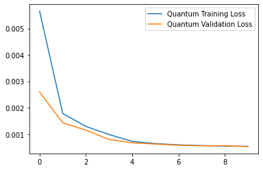

 

   
   
   

## Context
Pricing is very strategic and it makes a big difference in how a business operates. Many businesses operate on a fixed pricing model comes with serious drawbacks. It relies on fickle buyers who are price sensitive. This makes you more vulnerable to price wars. If one of your competitors drops their prices, your buyers are at risk of jumping ship. Also fixed-price model throttles long-term relationships. You don’t have time to connect with customers. 
This is where <strong>Dynamic Pricing</strong> comes to save the day!
 
 
 

## What is <strong>Dynamic Pricing </strong> ?
Dynamic pricing, a strategy which enables businesses to provide flexible prices for products and services is now catching on across hospitality, retail, travel and entertainment industry segments. Whether the aim is to stay profitable, fill up an airplane or sell as many sports tickets or products online as possible, companies today are using dynamic pricing to achieve their business goals.
 
 
 
## Dataset
Dynamic Pricing can be applied to various buissness, but here we apply it to predict fare prices of OLA CABS. 
The dataset contains various parameters on which the price of fare depends. 
Click here to download the dataset.
 
 
 

## Methodology:
Our solution consists of two parts:  
<ul>
-Using <strong> Quantum Neural Networks </strong> for predcting fare prices.  
-Using <strong>Ising model</strong> for optimal discount prediction.
</ul>
 
 
 

 

##  Conclusion:
Even with small number of epochs and short circuit depth the loss is pretty good.  
Implementing the code on Quantum Hardware with high number of epoches and large circuit depths would result in great accuracies in very less time.

## TechStack Used:
<ul>
1. Python  
2. Scikitlearn  
3. Numpy  
4. Pandas  
5. Tensorflow Quantum   
6. Dwave Systems 
7. Cirq  
</ul>

## Support
⭐ Please Star and share the project. Thanks! ❤️
